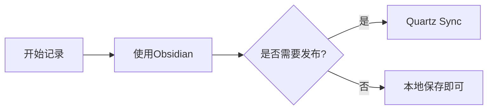
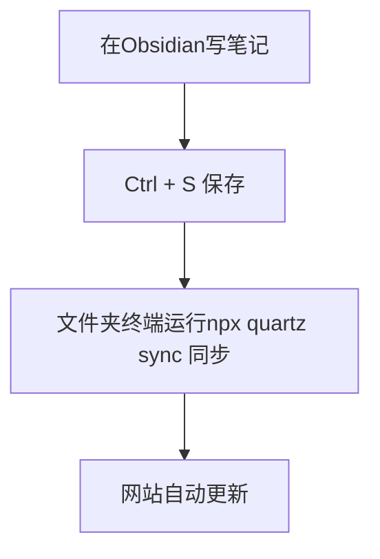

# Obsidian 使用指南

>[!note] 写作目的
>记录我学习Obsidian的过程，简单写一个小教程

## 基础特征

### 双向链接

用 `[[文件名]]` 创建笔记之间的链接

### 标签

笔记中`#编程` `#玄学`， 可以在标签列表聚合查看

### Callout 提示框

>[!example] 示例
>这是一个示例框

> [!warning] 注意 
> 这是一个警告框 
> 

> [!tip] 提示
> 这是一个提示框 

> [!important] 重要
> 这是一个重点框

### Mermaid 流程图

### 数学公示

行内公式：$E = mc^2$

块级公示：

$$
\sum_{i=1}^{n} x_i = x_1 + x_2 + \cdots + x_n
$$

## 已装插件

### 1. Templater

新建笔记自动应用模板，告别每次重复写 frontmatter。

### 2. Excalidraw

手绘图工具，画原理图、流程图、思维导图都很方便。

例如：
![[太极图.excalidraw]]

## 四、工作流

## 五、快捷键速查

| 操作      | 快捷键              |
| ------- | ---------------- |
| 新建笔记    | Ctrl + N         |
| 搜索笔记    | Ctrl + O         |
| 全文搜索    | Ctrl + Shift + F |
| 切换编辑/预览 | Ctrl + E         |
| 命令面板    | Ctrl + P         |

## 六、踩过的坑 
> [!warning] CSS 样式问题 
> 部署到自定义域名时，记得删除 `base` 配置，否则会乱码。 
> 

> [!warning] 中文文件名 
> 不要在文件名里用中文，会导致 Git 部署失败。

